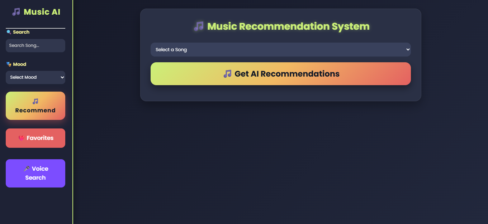
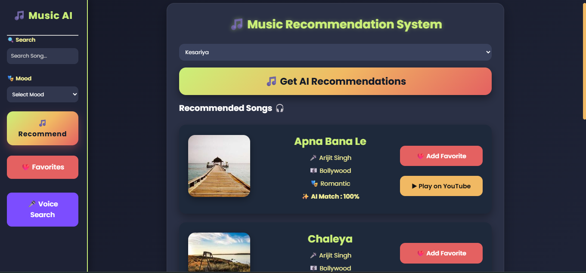
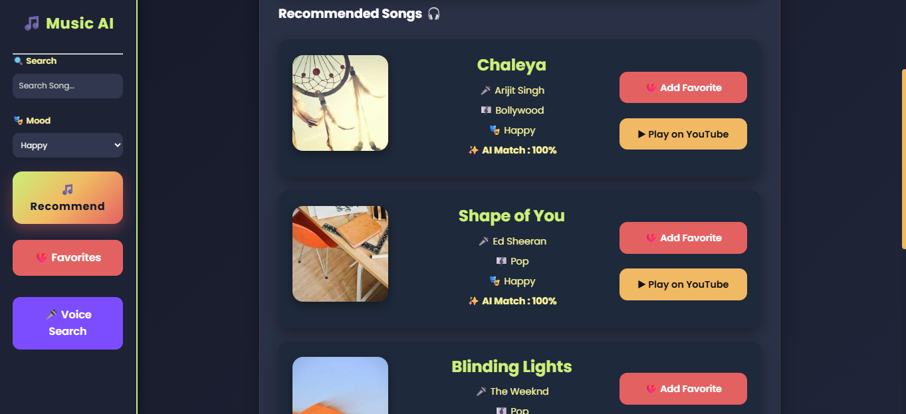
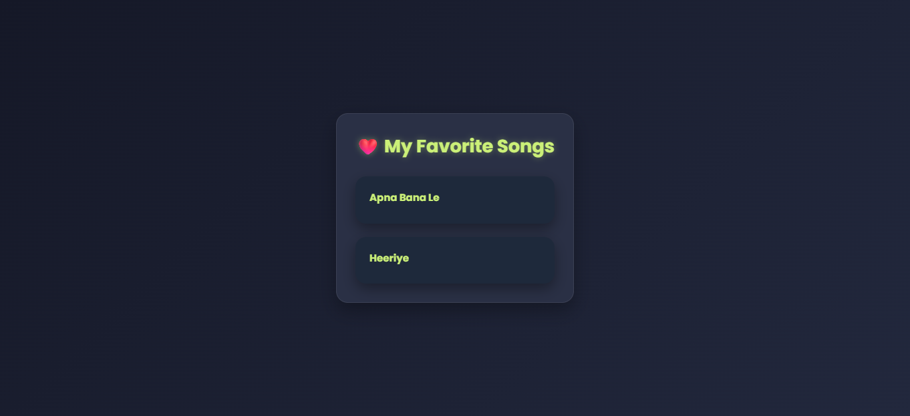

# 🎵 Music Recommendation System

An AI-powered **Music Recommendation System** built using **Python, Flask, Machine Learning, HTML, CSS, and JavaScript**. This web application recommends songs based on user preferences and mood, supports voice search, allows users to save favorite songs, and provides quick access to songs through YouTube.

---

## 📖 Overview

The Music Recommendation System is a web application that helps users discover songs based on their interests and mood. It uses Machine Learning techniques to recommend similar songs while providing a clean, responsive, and user-friendly interface.

---

## ✨ Features

- 🎵 AI-Based Music Recommendation
- 😊 Mood-Based Song Recommendation
- ❤️ Add & Manage Favorite Songs
- 🎤 Voice Input Search
- 🔍 Search Songs by Name
- ▶️ Play Songs on YouTube
- ⚡ Fast Recommendation System
- 📱 Responsive & User-Friendly Interface

---

## 🛠️ Tech Stack

### Frontend
- HTML5
- CSS3
- JavaScript

### Backend
- Python
- Flask

### Machine Learning
- Pandas
- Scikit-learn

---

## 📂 Project Structure

```text
Music-Recommendation-System/
│
├── app.py
├── music.csv
├── requirements.txt
├── README.md
├── .gitignore
│
├── screenshots/
│   ├── home.png
│   ├── recommendation.png
│   ├── mood.png
│   └── favourite.png
│
├── static/
│   └── style.css
│
└── templates/
    └── index.html
```

---

## ⚙️ Installation

### 1. Clone the Repository

```bash
git clone https://github.com/RiddhiParmar26/Music-Recommendation-System.git
```

### 2. Navigate to the Project Folder

```bash
cd Music-Recommendation-System
```

### 3. Install Dependencies

```bash
pip install -r requirements.txt
```

### 4. Run the Application

```bash
python app.py
```

### 5. Open in Your Browser

```
http://127.0.0.1:5000/
```

---

## 📊 Dataset

The project uses a custom **music.csv** dataset containing:

- 🎵 Song Name
- 🎤 Artist
- 🎼 Genre
- 😊 Mood
- ▶️ YouTube Link

---

## 📸 Screenshots

### 🏠 Home Page



---

### 🎵 Music Recommendation



---

### 😊 Mood-Based Recommendation



---

### ❤️ Favorite Songs



---

## 🚀 Future Improvements

- 👤 User Login & Authentication
- 🎼 Playlist Management
- 🤖 Personalized AI Recommendations
- 🌙 Dark/Light Theme
- 📈 Recommendation History
- ☁️ Cloud Database Integration

---

## 👩‍💻 Developer

**Riddhi Parmar**

💻 GitHub: **https://github.com/RiddhiParmar26**

---

## 📄 License

This project is developed for educational and learning purposes.

---

## ⭐ Support

If you found this project helpful, please consider giving it a **⭐ Star** on GitHub.

Thank you for visiting this repository! 🎵🚀